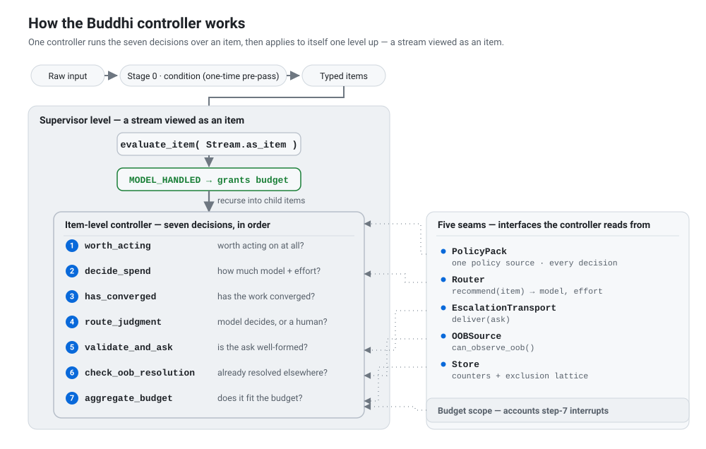

# Buddhi

[](https://pypi.org/project/buddhikernel/)
[](https://pypi.org/project/buddhikernel/)
[](https://github.com/buddhikernel/buddhi/actions/workflows/ci.yml)
[](https://doi.org/10.5281/zenodo.20509989)
[](LICENSE)

**Buddhi is the discriminative layer for autonomous agents: it decides when to act, how much
effort a task deserves, when to stop, and when a human should decide.**

Buddhi sits above the runtime that calls models and runs tools. It is a small,
runtime-neutral kernel that allocates a bounded *cognitive budget* of model effort and
human interruptions across a stream of work.

It neither executes nor schedules the work. It decides how much attention each item
deserves, and whether the model or a person should make the judgment.

## Why Buddhi

An agent runtime already knows how to invoke models and tools and drive a task to completion.
What it usually lacks is a principled way to decide, before and during that work:

- which items deserve attention at all;
- how much model effort each item is worth;
- when further work has stopped adding value;
- when a decision genuinely belongs to a human;
- how to bound total model effort and the number of human interruptions.

Left unmanaged, a supervisor over a stream of agent work fails in three common ways:

- **Over-acting:** acting autonomously when human judgment was required, or spending effort
  on an item that should have been discarded.
- **Over-asking:** interrupting a human where the system could have decided for itself.
- **Over-iterating:** continuing after further work has stopped producing value.

Buddhi is the layer that holds all three in check within one budgeting framework. It treats
cognition (machine effort and human attention alike) as the scarce resource, and decides,
per item, where that resource is spent or withheld.

## A concrete example: Buddhi Review

The abstraction is easiest to see through a real adapter.
[Buddhi Review](https://github.com/buddhikernel/buddhi-review) is a PR review-and-fix loop for
Claude Code, built on this kernel. It maps each review finding into a kernel work item; the
kernel returns a disposition, and the adapter translates that result into the matching review
action: fix, ask, skip, or defer.

The division of labour is the point:

- the **kernel** owns the decision;
- the **adapter** owns GitHub, model, and application-specific I/O;
- the adapter does not reimplement the kernel's decision logic; it carries out the disposition.

PR review is one adapter of the kernel, not the definition of Buddhi. The same interface is
intended for other streams of agent work: an issue tracker's comments, a task queue, an
agent's inbox. It applies wherever something must decide how much cognition each item
deserves and when a human should step in.

## Try it

The published package runs the demo directly, with no clone needed:

```bash
python -m pip install buddhikernel
python -m buddhi
```

The demo runs the reference implementation through the principal item-level and nested-stream
decision paths. A successful run prints `SMOKE PATH OK` and exits 0.

<details>
<summary>What the demo covers</summary>

Six demonstrations, in order: Stage 0 conditioning; the seven decisions over one stream; the
closure operator over a stream of streams; the two-tier exclusion lattice; the adapter
contract; and the hierarchical budget (a shared pool vs. a partitioned one).

</details>

### From source

Clone to work on the kernel or run the test suite:

```bash
git clone https://github.com/buddhikernel/buddhi
cd buddhi
python -m pip install -e ".[test]"
python -m pytest tests/ -q
```

The kernel is pure standard library, with no runtime dependencies.

## How it works

One controller, `evaluate_item()`, runs over each item and works through seven questions in
order, stopping at the first one that settles the item:

1. **Should this item get any attention?** A cheap gate discards items that need no work, so
   the budget is never spent on them.
2. **How much model effort may it use?** A pluggable Router proposes a model and effort level;
   the kernel clamps that pick to the stream's ceiling, so no item can outspend its stream.
3. **Has further work stopped adding value?** A stop detector ends the loop on convergence. A
   transient failure is retried, never mistaken for progress.
4. **Can the model decide, or is human judgment required?** A confidence threshold routes the
   call; anything the model is not confident enough to settle is deferred to a person.
5. **Is the proposed escalation specific and answerable?** A malformed ask is rejected; a valid
   one is pre-reasoned into a short list of options (two to four) with one marked as
   recommended.
6. **Has the item already been resolved externally?** An adapter-supplied check may return
   `RESOLVED_OOB`; if it does, evaluation ends without delivering the escalation.
7. **Does the escalation clear the current admission bar?** As interruptions accumulate, the
   required confidence rises, so marginal asks are denied while high-confidence and genuinely
   high-stakes asks can still get through.

<picture>
  <source media="(max-width: 767px) and (prefers-color-scheme: dark)" srcset="docs/assets/controller-flow.mobile.dark.svg">
  <source media="(max-width: 767px)" srcset="docs/assets/controller-flow.mobile.svg">
  <source media="(prefers-color-scheme: dark)" srcset="docs/assets/controller-flow.dark.svg">
  
</picture>

<details>
<summary><strong>Decision modules and dispositions</strong></summary>

The controller lives in `buddhi/closure.py` as `evaluate_item()`; each decision is its own
module under `buddhi/decisions/`. The first decision that terminates returns one of seven
dispositions (`decide_spend` only annotates the item with an effort budget and never ends it):

| # | Decision (`module`) | Terminal disposition |
|---|---|---|
| 1 | `worth_acting` | `DISCARDED` |
| 2 | `decide_spend` (`effort_model`) | — (annotates effort; does not terminate) |
| 3 | `has_converged` (`convergence`) | `CONVERGED` |
| 4 | `route_judgment` (`judgment_routing`) | `MODEL_HANDLED` |
| 5 | `validate_and_ask` (`validity_and_ask`) | `INVALID_ASK` |
| 6 | `check_oob_resolution` (`oob_resolution`) | `RESOLVED_OOB` |
| 7 | `aggregate_budget` | `ESCALATED` or `DENIED` |

A deferred decision is represented as a *business question*: the kernel pre-reasons it into the
options above rather than emitting a bare yes/no prompt. Step 7 also enforces a two-tier
source-exclusion lattice (an excluded source is denied before the graduated admission bar is
consulted), and step 3 keeps transient failures in a bounded-retry class that is excluded from
convergence accounting. The rationale for each decision is in
[docs/decisions.md](docs/decisions.md).

</details>

## Composition and nested work

Buddhi reuses the same controller at two levels. At the item level, it decides how much
attention one item receives. At the parent level, it treats a child stream as an item and
decides how much budget that whole stream receives. The project calls this composition the
**closure operator**, and it is the centre of the design.

In code, `supervise_stream()` runs `evaluate_item()` over the items of one stream, and
`supervise_stream_of_streams()` runs the identical `evaluate_item()` over each child stream
viewed as an item (`Stream.as_item()`). When a child comes back `MODEL_HANDLED`, the parent has
granted it budget, and the operator recurses into that child's own items.

Budget allocation recurses; task coordination does not. The kernel accounts budget across
children through the shared Store, but it does no inter-stream coordination, conflict
avoidance, work partitioning, or locking. Coupled items, where acting on one changes whether
another is worth acting on, need a separate layer above the kernel.

The budget itself is a tree of scopes: a parent's ceiling bounds the combined spend of its
whole subtree. With a single scope, the tree reduces to one shared budget and one admission
bar, and the reference pack runs exactly that case. The mechanics, the invariants, and the
reduction are in [docs/budget.md](docs/budget.md).

## Architecture and extension points

The kernel is orchestration and depends on five interfaces, the **seams**; it ships no
production implementation of any of them. Domain adapters provide the real implementations. The
repository includes *reference* implementations (the naive pack) that run the demo and tests
end to end; they provide only minimal behaviour, not production policy.

| Seam | Interface | Feeds |
|---|---|---|
| **PolicyPack** | one runtime-neutral policy source: taxonomies, thresholds, phrasings, predicates | every decision, and Stage 0 |
| **Router** | `recommend(item) -> RouterPick(model, effort)` | `decide_spend` |
| **Store** | scope-keyed interrupt counters and a two-tier source-exclusion lattice | `aggregate_budget` |
| **EscalationTransport** | `deliver(ask)` | `validate_and_ask` |
| **OOBSource** | `can_observe_oob() -> bool` | `check_oob_resolution` |

**Stage 0** (`condition()`) is a one-time pre-pass that turns raw input into the typed items the
loop consumes. It is *anticipatory*: it shapes the stream so a class of demand never becomes
items at all, where the seven decisions are *reactive* and spend the budget. The kernel ships a
1:1 identity pass-through.

The rationale for why each decision and seam sits where it does is in
[docs/decisions.md](docs/decisions.md).

## Build an adapter

An adapter connects the kernel to a concrete runtime or domain. It supplies the substrate's I/O
and lets the kernel make every decision. The contract in `buddhi.adapter` has four operations:

| Operation | Does |
|---|---|
| `ingest()` | yield the substrate's items (an issue tracker's comments, a task queue, an inbox) |
| `run_embedded(item, budget)` | hand one item to the kernel and return its disposition |
| `escalate_async(ask)` | deliver the pre-reasoned ask through the EscalationTransport seam |
| `detect_resolved(item)` | report whether the item was resolved out of band |

To run the kernel on a new domain, supply a PolicyPack and implementations of Router, Store,
EscalationTransport, and OOBSource. The worked reference is `buddhi/reference/naive_pack.py`
(`NaiveAdapter`), and the step-by-step is in [docs/extending.md](docs/extending.md).

## Status and scope

Buddhi is **alpha**; the API may change before `1.0`. The honest split of what is demonstrated
versus asserted is in [docs/claim-and-bound.md](docs/claim-and-bound.md).

- **Demonstrated and runnable today.** The closure reuse (the supervisor runs the identical
  controller once per child), the budget invariants (effort ceiling, monotone admission bar,
  subtree conservation, termination, exclusion dominance), and the reduction to a single shared
  pool are each exercised by named tests. The reference pack and demo run end to end.
- **Asserted, not yet established.**
  [Buddhi Review](https://github.com/buddhikernel/buddhi-review) is one concrete external
  adapter, but this repository's own validation is still centred on the reference pack.
  Generality across substantially different substrates remains a design claim, not an
  established result.
- **Out of scope.** Coordination of coupled items is a boundary, not a gap to be patched; see
  [docs/limits.md](docs/limits.md) and [docs/positioning.md](docs/positioning.md) for why
  drawing that line keeps the kernel a control mechanism rather than a scheduler.

## The name

The Samkhya and Vedanta strands of faculty psychology separate two functions of the mind. Manas
is the deliberating faculty: it takes in what the senses report and forms and weighs
possibilities. Buddhi is the faculty that settles the matter; its defining act is determination
or ascertainment. Manas proposes; buddhi decides.

A generative model is manas-like: it generates, associates, and reacts. Buddhi is the faculty
above it, the one that discriminates what is worth acting on, how much thought a thing deserves,
when a matter is resolved, and when to hand it to a human.

The design also follows Herbert Simon's bounded rationality: cognition is scarce, so an agent
must allocate it according to marginal value rather than attempt exhaustive optimization. Buddhi
makes that allocation explicit and runnable. You can read more in
"[The name and the vision](docs/concept.md#the-name-and-the-vision)".

## Documentation

**Start here**

- [docs/concept.md](docs/concept.md) — the core idea: one controller, and how the operator and
  the budget compose.
- [docs/architecture.md](docs/architecture.md) — the nested diagram and a component-by-component
  walkthrough.

**Go deeper**

- [docs/closure.md](docs/closure.md) — the runnable closure centrepiece (`python -m buddhi`).
- [docs/decisions.md](docs/decisions.md) — the rationale for the seven decisions and five seams.
- [docs/budget.md](docs/budget.md) — the cognitive budget, the reduction theorem, and the
  invariants.

**Reference**

- [docs/glossary.md](docs/glossary.md) — terms, including the Simon-lineage disambiguation.
- [docs/claim-and-bound.md](docs/claim-and-bound.md) — the maturity ladder: demonstrated,
  asserted, out of scope.
- [docs/limits.md](docs/limits.md) — where it breaks: coupling, order, conservation.

**Positioning and building on it**

- [docs/positioning.md](docs/positioning.md) — what Buddhi is *not*, and why.
- [docs/extending.md](docs/extending.md) — implementing the seams for a new domain.
- [CONTRIBUTING.md](CONTRIBUTING.md) — how to contribute.

## License and citation

Apache-2.0. See [LICENSE](LICENSE). To cite Buddhi, see [CITATION.cff](CITATION.cff) or the
archived release ([DOI](https://doi.org/10.5281/zenodo.20509989)).
