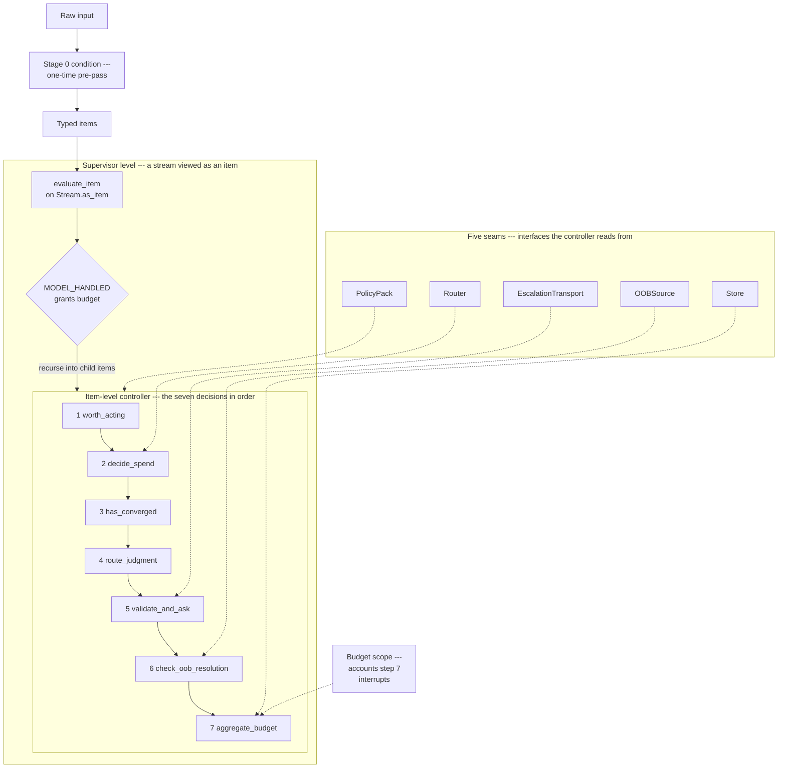

# Buddhi

[](https://pypi.org/project/buddhikernel/)
[](https://pypi.org/project/buddhikernel/)
[](https://github.com/buddhikernel/buddhi/actions/workflows/ci.yml)
[](https://doi.org/10.5281/zenodo.20509989)
[](LICENSE)

Buddhi is a composable controller for allocating a bounded *cognitive budget* (a finite ration of model effort and human interruptions) across a stream of work. It decides, per item, whether the item is worth acting on, how much to spend on it, when to stop, and when to defer to a human, all under one budget.

## The idea

A single composable controller, `evaluate_item()`, runs over each item in turn. For that item it asks, in order: is this worth acting on at all; which model, and how much effort, to spend (clamped to the stream's effort ceiling and the iteration budget); has it converged; should the model decide or defer this to a human as a business question; is the proposed ask well-formed and worth escalating; was it already resolved out of band; and does the escalation clear the budget's admission bar. The same controller composes one level up. In the closure, a stream of streams is supervised by viewing each child stream *as* an item and running it through the identical `evaluate_item()`, recursing into a child's own items only when the parent grants it budget. Allocation recurses; nothing else does.

## What Buddhi is

Buddhi is a small, runtime-neutral kernel: a single control function that sits above a stream of agent or automation work and decides where a bounded cognitive budget is spent. It is a control mechanism, not a scheduler or an agent framework. It allocates effort and human attention across work and leaves the work itself, and any coordination between coupled items, to the layers around it. Everything domain-specific enters through five seams the kernel exposes but never implements.



At a glance, the core terms (each links to the document that defines it):

- **[The seven decisions](docs/decisions.md)** — the per-item controller: worth acting, how much to spend, has it converged, route to model or human, validate the ask, check out of band, admit against the budget.
- **[Stage 0 conditioning](docs/architecture.md)** — a one-time pre-pass that turns raw input into the typed items the controller consumes.
- **[The closure operator](docs/closure.md)** — the same controller one level up, supervising a stream of streams by treating each child stream as an item.
- **[The hierarchical budget](docs/budget.md)** — the bounded cognitive budget the kernel spends: a tree of scopes whose per-subtree ceilings bound total spend, collapsing to a single shared pool in the simple case.
- **[The two-tier exclusion lattice](docs/glossary.md)** — the Store's hard guarantee: permanent and retractable-transient source exclusions that never cross tiers.
- **[The policy contract](docs/decisions.md)** — the PolicyPack, one runtime-neutral source for every taxonomy, threshold, phrasing, and predicate.
- **[The seams and the adapter contract](docs/extending.md)** — the five interfaces the kernel exposes but never implements, and the adapter that binds them to a concrete substrate.

For the full walkthrough, start with the concept and the architecture; to run it, read on.

## Run it

```bash
git clone https://github.com/buddhikernel/buddhi
cd buddhi
pip install -e .            # the kernel (pure stdlib, no runtime deps)
pip install -e ".[test]"    # add the test extra
```

From the repository root, run the demo:

```bash
python -m buddhi
```

It runs six demonstrations on the reference (naive) pack: Stage 0 conditioning, the seven decisions over one stream, the closure operator over a stream of streams, the two-tier exclusion lattice, the adapter contract, and the hierarchical budget (shared pool vs. partitioned), ending in `SMOKE PATH OK` and exit 0.

Run the tests the same way:

```bash
python -m pytest tests/ -q
```

## What's included

Seven decisions (one module each), a one-time Stage 0 conditioning pre-pass, and the closure operator, all driven by a single policy contract, the PolicyPack, plus four further seams the kernel exposes as interfaces (Router, Store, EscalationTransport, OOBSource). No concrete implementation of any seam ships in the kernel; instead a competent naive reference fills each one: the simplest correct behavior, enough to run the demo and the tests end to end, not a production method. Pure standard library, no runtime dependencies.

## Documentation

**Start here**

- [docs/concept.md](docs/concept.md) — the core idea: one controller, and how the operator and the budget compose.
- [docs/architecture.md](docs/architecture.md) — the nested diagram and a component-by-component walkthrough.

**Go deeper**

- [docs/closure.md](docs/closure.md) — the runnable closure centerpiece (`python -m buddhi`).
- [docs/decisions.md](docs/decisions.md) — ADR-style rationale for the seven decisions and five seams.

**Reference**

- [docs/glossary.md](docs/glossary.md) — terms, including the Simon-lineage disambiguation.
- [docs/claim-and-bound.md](docs/claim-and-bound.md) — the maturity ladder: proven, asserted, out of scope.
- [docs/budget.md](docs/budget.md) — the cognitive budget, the reduction theorem, and the invariants.
- [docs/limits.md](docs/limits.md) — where it breaks: coupling, order, conservation.

**Positioning**

- [docs/positioning.md](docs/positioning.md) — what Buddhi is *not*, and why.

**Building on it**

- [docs/extending.md](docs/extending.md) — implementing the seams for a new domain.
- [CONTRIBUTING.md](CONTRIBUTING.md) — how to contribute.

## License and citation

Apache-2.0. See [LICENSE](LICENSE). To cite Buddhi, see [CITATION.cff](CITATION.cff).
