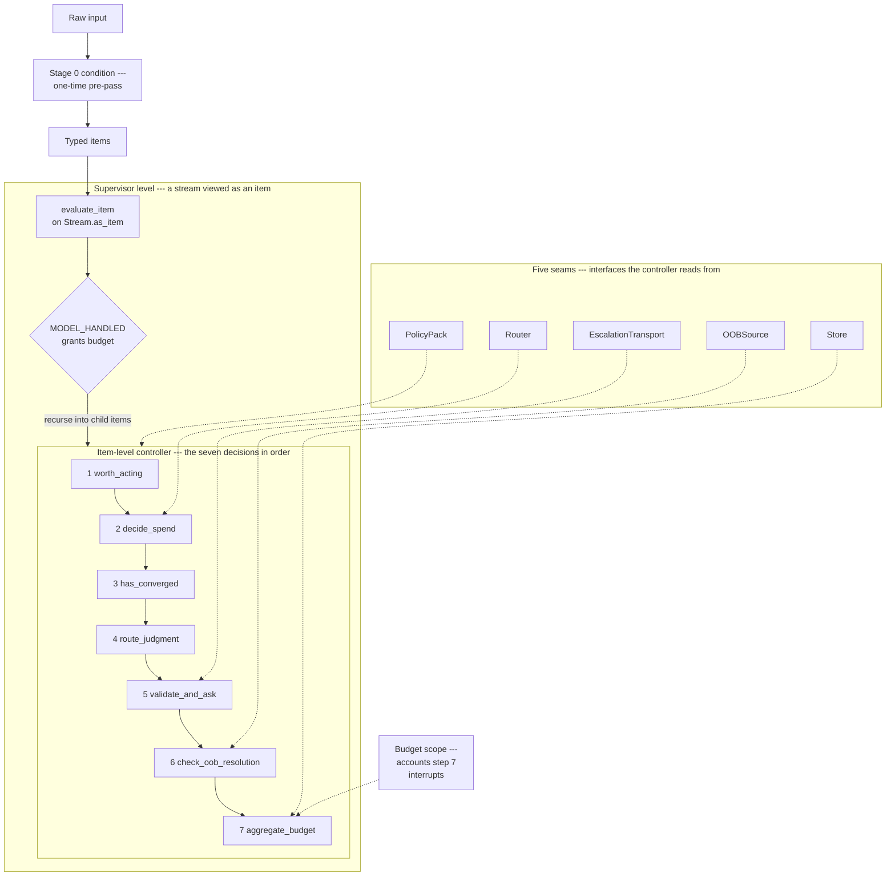

# Architecture

Buddhi is one composable controller. The function `evaluate_item()` in
`buddhi/closure.py` runs [seven functions](#the-seven-decisions-and-their-dispositions),
in order, over a single typed item. The same function runs over a stream viewed as
an item; that is the closure. This file walks through the parts and how they nest.

## Stage 0: the one-time pre-pass

Before the loop runs, `condition()` in `buddhi/stage0/conditioning.py` maps raw
input to the typed `Item` the loop consumes. It runs once, ahead of everything
else. The kernel ships a 1:1 identity pass-through: each raw item becomes a typed
item unchanged. A pack-supplied trigger-detection hook may flag an item; the naive
records the flag and leaves the payload untouched (the hook defaults to a no-op).
Stage 0 is a seam like any other: the kernel publishes the contract and the
simplest correct fill.

## The seven decisions and their dispositions

`evaluate_item()` is pure orchestration. It calls each decision in fixed order and
returns the first disposition that ends the item:

1. **`worth_acting`**: a cheap rule-based discard gate (default keep-all). Fails
   → `DISCARDED`.
2. **`decide_spend` / `effort_model`**: how much model and effort to spend. It
   takes the Router seam's per-item pick and clamps it to the stream's effort
   ceiling and the iteration budget. This decision annotates; it does not end the
   item.
3. **`has_converged`**: the stop detector. Converged → `CONVERGED`. Transient
   failures form a bounded-retry class excluded from convergence accounting, so a
   transient failure is never read as progress.
4. **`route_judgment`**: the model decides, or the item defers to a human as a
   business question, governed by a confidence threshold. Model-handled →
   `MODEL_HANDLED`.
5. **`validate_and_ask`**: reject malformed asks (→ `INVALID_ASK`); otherwise
   pre-reason 2–4 options with one starred recommendation and an escalation
   confidence.
6. **`check_oob_resolution`**: was this already resolved out of band? Resolved →
   `RESOLVED_OOB`.
7. **`aggregate_budget`**: admit or deny the escalation against the scope's
   graduated bar and the two-tier exclusion lattice. Admitted → `ESCALATED` (the
   ask is delivered); otherwise → `DENIED`.

The full seven dispositions are `DISCARDED`, `CONVERGED`, `MODEL_HANDLED`,
`INVALID_ASK`, `RESOLVED_OOB`, `ESCALATED`, `DENIED`. The per-decision rationale
lives in [`./decisions.md`](./decisions.md).

## The closure recursion

`supervise_stream()` is the base case: it runs `evaluate_item()` over every item
of one stream. `supervise_stream_of_streams()` is the closure operator. It views
each child stream as an item via `Stream.as_item()` and runs that item through the
identical `evaluate_item()`: the same seven decisions, one level up. When the
parent grants budget (the child comes back `MODEL_HANDLED`), the kernel recurses
into that child's items through `supervise_stream`. "How much to spend on this
item" and "how much budget to grant this work stream" are the same question
answered by the same function.

This is allocation-recursion only. The kernel has no inter-stream coordination, no
conflict avoidance, no work partitioning, and no locking. The shared Store does
budget accounting across children, never work coordination. The runnable
centerpiece is in [`./closure.md`](./closure.md).

## The five seams

The kernel exposes five interfaces and ships no concrete implementation of any of
them:

- **PolicyPack**, the single runtime-neutral policy source: taxonomies,
  thresholds, phrasings, and predicates supplied at each decision and at Stage 0.
- **Router**, `recommend(item) -> RouterPick(model, effort)`, per-item model and
  effort selection (a commodity the kernel consumes; it claims no novelty here).
- **Store**, scope-keyed interrupt counters plus a two-tier source-exclusion
  lattice; permanent and retractable-transient causes never cross between tiers.
- **EscalationTransport**, `deliver(ask)`, which delivers the pre-reasoned ask;
  the kernel holds only the interface, never a concrete transport.
- **OOBSource**, `can_observe_oob() -> bool`, declaring whether the substrate can
  ever observe an out-of-band resolution.

Each seam ships the simplest correct fill in the reference pack. Implementing them
for a new domain is covered in [`./extending.md`](./extending.md).

## Where the budget scope lives

Step 7 accounts each admitted interrupt under a budget `scope`. The scope defaults
to the single global pool, so a flat run charges every item against one shared
budget with one monotone admission bar. When the closure partitions children, each
granted subtree gets its own scope (derived from its parent's), so a parent bounds
its own subtree's spend: each child spends against its own counter, yet every
admit accrues up the path, so the parent ceiling bounds their combined spend. The
budget is a tree of weighted scopes, and the degenerate case collapses cleanly
back to that single shared pool. The full treatment, with the reduction theorem
and the invariants, is in [`./budget.md`](./budget.md).

For term definitions, including the Simon-lineage disambiguation of the
cognitive budget, see [`./glossary.md`](./glossary.md).
